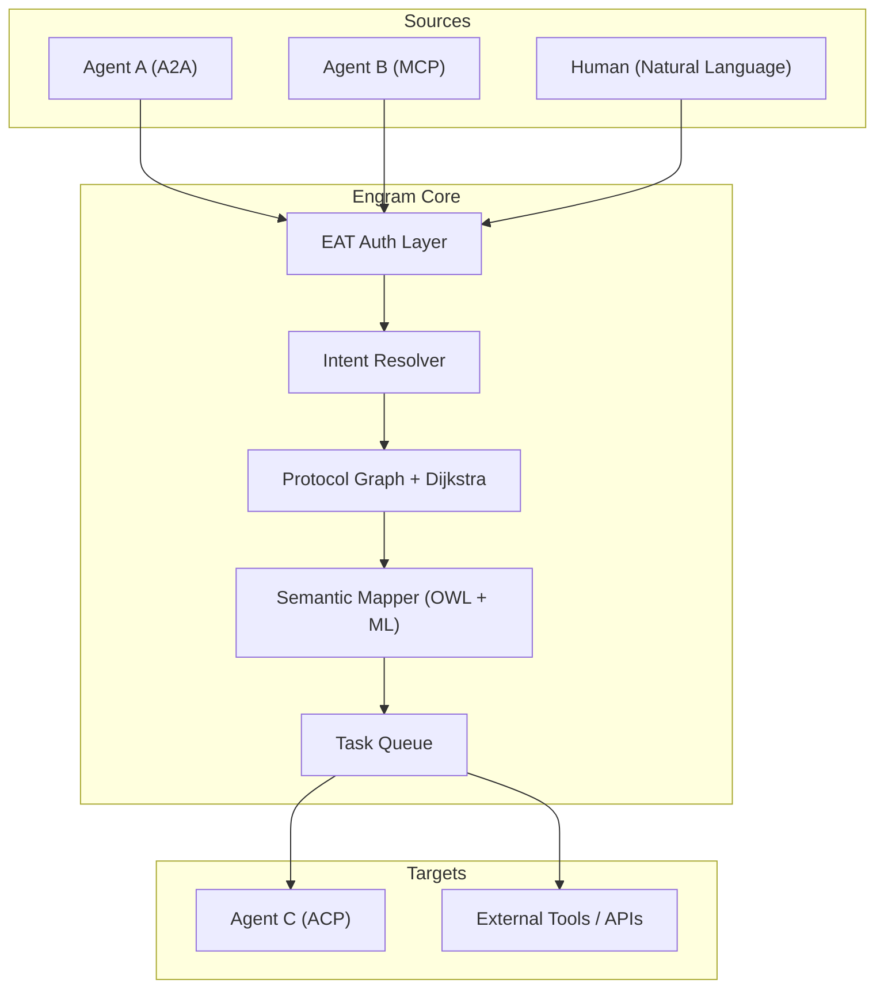

<p align="center">
  
</p>

<h1 align="center">Engram</h1>

<p align="center">
  <strong>CONNECT ANY AGENT. ANY TOOL. ANY API.</strong><br>
  One identity layer. One routing engine. One semantic bridge.
</p>

<p align="center">
  <a href="LICENSE"></a>
  
  
  
</p>

The lightweight interoperability layer that sits between AI agents, tools, and APIs. It translates protocols (A2A ↔ MCP ↔ ACP), auto-fixes schema mismatches with OWL ontologies + self-healing ML, routes tasks through a performance-weighted graph, and gives every participant a single token (EAT). No more custom glue code — register once, talk to anything.

<p align="center">
  <a href="https://useengram.com">Website</a> &#183;
  <a href="https://docs.useengram.com">Docs</a>
</p>

---

## Quick Install

```bash
git clone https://github.com/kwstx/engram_translator.git && cd engram_translator
docker compose up --build -d
```

Open `http://localhost:8000/docs` for the Swagger UI. The full stack (PostgreSQL, Redis, Prometheus, Grafana) starts automatically.

**Windows (no Docker):**
```powershell
pip install -r requirements.txt
.\engram.bat
```

**Linux / macOS (no Docker):**
```bash
chmod +x setup.sh && ./setup.sh
python app/cli.py
```

---

## What It Does

| Capability | How |
| :--- | :--- |
| **Protocol translation** | Full bidirectional A2A ↔ MCP ↔ ACP conversion. Multi-hop routing via Dijkstra when no direct edge exists. |
| **Self-healing semantics** | OWL ontology → PyDatalog rules → TF-IDF/LogReg ML fallback. Auto-applies fixes at ≥ 85% confidence and retrains itself. |
| **Performance-aware routing** | NetworkX graph with dynamic weights from agent latency and success rate. Dead agents dropped by heartbeat. |
| **Unified identity** | One JWT-based Engram Access Token (EAT) per participant. Scoped to protocols and tools. Issued on `/signup`. |
| **Natural-language delegation** | Free-text commands decomposed into atomic tasks, mapped to agent capabilities, and routed — no protocol knowledge needed. |
| **Cryptographic proofs** | Every translation hop produces a SHA-256 proof. Multi-hop chains return an aggregate `v1:agg:<hash>`. |
| **Production observability** | Prometheus metrics, Grafana dashboards, real-time TUI debug console with structured event streaming. |

---

## Getting Started

```bash
# 1. Register an agent
curl -X POST http://localhost:8000/api/v1/register \
  -H "Content-Type: application/json" \
  -d '{
    "agent_id": "my-agent",
    "supported_protocols": ["MCP"],
    "capabilities": ["shell", "web"],
    "semantic_tags": ["automation"],
    "endpoint_url": "http://my-agent:9000"
  }'

# 2. Translate a message between protocols
curl -X POST http://localhost:8000/api/v1/beta/translate \
  -H "Authorization: Bearer <your-eat-token>" \
  -H "Content-Type: application/json" \
  -d '{
    "source_protocol": "A2A",
    "target_protocol": "MCP",
    "payload": { "intent": "dispatch" }
  }'

# 3. Delegate a task in plain English
curl -X POST http://localhost:8000/api/v1/delegate \
  -H "Authorization: Bearer <your-eat-token>" \
  -H "Content-Type: application/json" \
  -d '{"command": "Summarize the latest release and send it to Slack"}'
```

---

## How It Works



---

## Works With Anything

Any agent, tool, or API that speaks A2A, MCP, or ACP — register once and Engram handles the rest. No adapters, no glue code.

```bash
# MCP agent? One call.
curl -X POST http://localhost:8000/api/v1/register \
  -d '{"agent_id": "my-agent", "supported_protocols": ["MCP"], "endpoint_url": "http://my-agent:9000"}'

# A2A agent? Same call.
curl -X POST http://localhost:8000/api/v1/register \
  -d '{"agent_id": "other-agent", "supported_protocols": ["A2A"], "endpoint_url": "http://other-agent:8080"}'
```

If it has an endpoint and speaks a supported protocol, it works.

---

## Python SDK

```python
from engram_sdk import EngramSDK

sdk = EngramSDK(
    base_url="http://localhost:8000/api/v1",
    eat="<YOUR_EAT>",
)

result = sdk.translate(
    {"intent": "schedule_meeting", "participants": ["alice", "bob"]},
    source_protocol="a2a",
    target_protocol="mcp",
)

print(result.payload)  # Translated MCP-format payload
```

---

## TUI Dashboard

Run `python app/cli.py debug` for a live terminal dashboard:

| Command | Action |
| :--- | :--- |
| `/status` | Health of bridge, memory silos, workers |
| `/agents` | Connected agents and compatibility scores |
| `/clear` | Clear event logs |
| **Any text** | Auto-routed to the Delegation Engine |

Key bindings: `Q` quit · `C` clear · `R` refresh metrics

---

## Configuration

All config via environment variables (`.env` file):

| Variable | Description |
| :--- | :--- |
| `DATABASE_URL` | PostgreSQL connection string |
| `REDIS_ENABLED` | `true` to enable semantic cache |
| `AUTH_JWT_SECRET` | Secret key for signing EATs |
| `AUTH_ISSUER` | Expected JWT issuer |
| `AUTH_AUDIENCE` | Expected JWT audience |
| `MIROFISH_BASE_URL` | MiroFish instance URL (default: `localhost:5001`) |

---

## Performance

JMeter-verified on local Docker stack:

| Metric | Result |
| :--- | :--- |
| **Throughput** | ≥ 150 req/sec |
| **p50 Latency** | ≤ 120 ms |
| **p99 Latency** | ≤ 600 ms |

---

## Documentation

| Resource | Link |
| :--- | :--- |
| Full docs | [docs.useengram.com](https://docs.useengram.com) |
| API reference (Swagger) | `http://localhost:8000/docs` |
| Architecture | [ARCHITECTURE.md](ARCHITECTURE.md) |
| Deployment | [DEPLOYMENT.md](DEPLOYMENT.md) |
| Contributing | [CONTRIBUTING.md](CONTRIBUTING.md) |

---

## License

[MIT](LICENSE)
