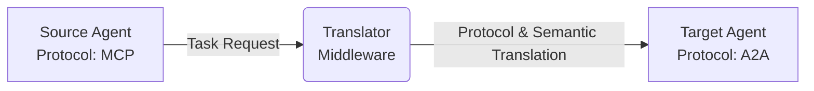

# Agent Translator Middleware

A middleware service that acts as a bridge between AI agents using different communication protocols (A2A, MCP, ACP). It translates the protocol envelope and resolves semantic differences in the data payload so agents can interact regardless of their native protocol.

## Why Agent Translator Middleware?

AI agents today are often isolated because they speak different protocols (MCP, ACP, native A2A) and use differing data schemas. This middleware acts as a universal translator, allowing an MCP-based agent to seamlessly hand off a task to an ACP-based agent without either needing to change their underlying code.



---

## Core Features

*   **Protocol Translation:** Converts messages and payloads between A2A, MCP, and ACP formats.
*   **Semantic Mapping:** Uses OWL ontologies, JSON Schema, and PyDatalog to map data fields between different agent schemas (e.g., mapping `user_info.name` to `profile.fullname`).
*   **Agent Registry & Discovery:** Agents register their supported protocols and semantic capabilities. Other agents can query the registry to discover compatible collaborators based on calculated matching scores.
*   **Async Orchestration:** Uses task queues and worker processes to handle multi-turn agent handoffs, message leases, and retries.
*   **Fallback Mapping:** Implements a machine learning model to suggest field mappings when default semantic rules fail.

---

## Quick Start

The standard way to run the middleware with its dependencies (Neon, Redis) is using Docker Compose.

```bash
docker compose up --build
```

Once running, the Swagger UI API documentation is available at:  
`http://localhost:8000/docs`

---

## Authentication Prerequisites

Some endpoints (such as message translation) require a JSON Web Token (JWT) for authorization. Ensure you have your token configured and that its issuer and audience match the `AUTH_ISSUER` and `AUTH_AUDIENCE` environment variables. For local testing, you can use the built-in development utilities to mock or mint a token.

---

## Usage Examples

Here is a typical workflow to connect two isolated agents using the middleware API.

### 1. Register the Scheduling Agent
Add an agent to the registry, defining its supported protocols and capabilities.

```bash
curl -X POST http://localhost:8000/api/v1/register \
  -H "Content-Type: application/json" \
  -d "{\"agent_id\":\"agent-a\",\"endpoint_url\":\"http://agent-a:8080\",\"supported_protocols\":[\"a2a\"],\"semantic_tags\":[\"scheduling\"],\"is_active\":true}"
```

**Example Response:**
```json
{
  "message": "Agent agent-a registered successfully",
  "status": "active"
}
```

### 2. Discover a Compatible Collaborator
Search the registry for available agents that match specific protocols or semantic requirements (e.g., finding an agent that can handle scheduling).

```bash
curl -X GET "http://localhost:8000/api/v1/discovery/collaborators"
```

**Example Response:**
```json
{
  "collaborators": [
    {
      "agent_id": "agent-a",
      "supported_protocols": ["a2a"],
      "compatibility_score": 0.95
    }
  ]
}
```

### 3. Send a Meeting Request Across Protocols
Send a message from a source agent to a target agent. The middleware receives the request, translates the protocol and payload, and forwards it to the target.

*(Note: Requires a Bearer token in the Authorization header as described in the Prerequisites)*

```bash
curl -X POST http://localhost:8000/api/v1/translate \
  -H "Authorization: Bearer <JWT_TOKEN>" \
  -H "Content-Type: application/json" \
  -d "{\"source_agent\":\"agent-b\",\"target_agent\":\"agent-a\",\"payload\":{\"intent\":\"schedule_meeting\"}}"
```

**Example Response:**
```json
{
  "status": "success",
  "source_protocol": "mcp",
  "target_protocol": "a2a",
  "translated_payload": {
    "action": "book_calendar",
    "details": "meeting"
  },
  "delivery_status": "forwarded"
}
```

---

## Configuration

Configuration is managed via environment variables. Create a `.env` file in the root directory for local overrides. 

| Variable | Description |
| :--- | :--- |
| `ENVIRONMENT` | Operating environment (`development`, `production`). |
| `DATABASE_URL` | Neon connection string. |
| `REDIS_ENABLED` | Set to `true` to use Redis for semantic cache. |
| `AUTH_ISSUER` | Expected JWT issuer for validation. |
| `AUTH_AUDIENCE` | Expected JWT audience for validation. |
| `AUTH_JWT_SECRET` | Secret key required for JWT verification. |

---

## Local Development Setup

To run the application directly on your machine without Docker:

```bash
# 1. Create and activate a virtual environment
python -m venv venv
source venv/bin/activate  # On Windows: venv\Scripts\activate

# 2. Install dependencies
pip install -r requirements.txt

# 3. Start the application
uvicorn app.main:app --reload
```

Run test suite:
```bash
pytest -q
```

---

## Troubleshooting

*   **HTTP 401/403 on Translation**: Ensure an `Authorization: Bearer <TOKEN>` header is provided. The token's issuer and audience must match your `AUTH_ISSUER` and `AUTH_AUDIENCE` settings.
*   **Translation/Mapping Errors**: Check the application logs. If the semantic engine fails to map fields, check the ML fallback suggestions in the logs or upload an updated ontology file.
*   **Database Connection Failed**: Ensure the Neon database is reachable and the `DATABASE_URL` is set correctly.

---

## Documentation

*   [Architecture (ARCHITECTURE.md)](ARCHITECTURE.md): System components, data silos resolution, and overall architecture.
*   [Deployment (DEPLOYMENT.md)](DEPLOYMENT.md): Instructions for deploying to Render and Cloud Run.

---

## What's Next?

*   **Explore the API:** Once running, visit `http://localhost:8000/docs` to interact with the full Swagger UI.
*   **Customize Semantics:** Define your own custom semantic mapping rules (OWL/PyDatalog) to handle specific data structures required by your proprietary agents.
*   **Contribute:** Check the [Architecture](ARCHITECTURE.md) to understand the internals and start contributing to the core orchestration engine.