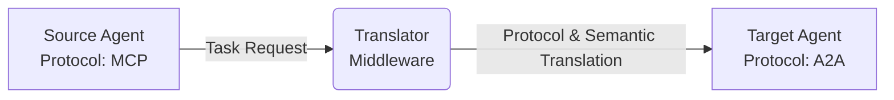
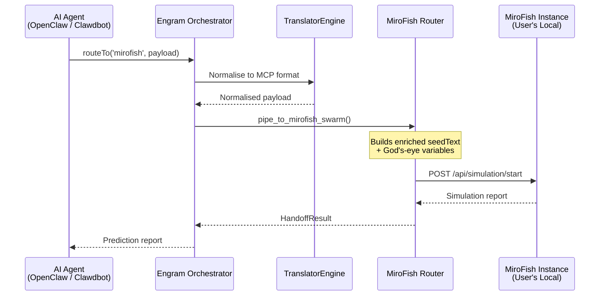
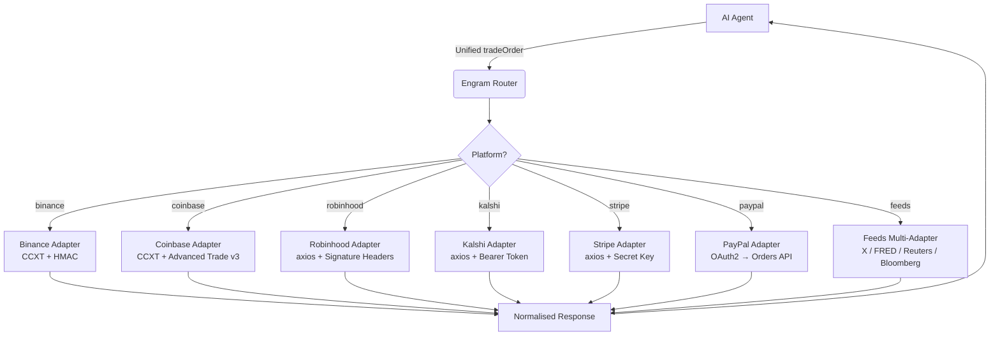

# Agent Translator Middleware

**The universal bridge for AI agents: translate protocols and schemas instantly to enable seamless cross-vendor collaboration.**

[](https://modelcontextprotocol.io)
[](#)
[](#)
[](https://opensource.org/licenses/MIT)

A middleware service that acts as a bridge between AI agents using different communication protocols (A2A, MCP, ACP). It translates the protocol envelope and resolves semantic differences in the data payload so agents can interact regardless of their native protocol.

## Why Agent Translator Middleware?

| Scenario | Without Translator | With Translator |
| :--- | :--- | :--- |
| **Agent Interop** | Isolated silos; MCP agents can't talk to ACP agents. | **Seamless Relay:** A2A ↔ MCP ↔ ACP communication. |
| **Data Mapping** | Manual re-coding for every new agent pair. | **Auto-Mapping:** Owlready2 + PyDatalog resolve field differences. |
| **Task Handoff** | Fails due to incompatible envelope structures. | **Robust Orchestration:** Multi-hop routing with retry logic. |

AI agents today are often isolated because they speak different protocols (MCP, ACP, native A2A) and use differing data schemas. This middleware acts as a universal translator, allowing an MCP-based agent to seamlessly hand off a task to an ACP-based agent without either needing to change their underlying code.



---

## Core Features

*   **Protocol Translation:** Converts messages and payloads between A2A, MCP, and ACP formats.
*   **Semantic Mapping:** Uses OWL ontologies, JSON Schema, and PyDatalog to map data fields between different agent schemas (e.g., mapping `user_info.name` to `profile.fullname`).
*   **MiroFish Swarm Bridge:** Pipe inter-agent messages and live data directly into a MiroFish swarm simulation and receive compiled prediction reports back — turning any agent into a predict + execute hybrid. [Details ↓](#-mirofish-swarm-bridge)
*   **Trading Semantic Templates:** Drop-in, one-click adapters for Binance, Coinbase, Robinhood, Kalshi, Stripe, PayPal, and live data feeds (X, FRED, Reuters, Bloomberg). One unified payload, multiple platforms. [Details ↓](#-multi-platform-trading-semantic-templates)
*   **Agent Registry & Discovery:** Agents register their supported protocols and semantic capabilities. Other agents can query the registry to discover compatible collaborators based on calculated matching scores.
*   **Async Orchestration:** Uses task queues and worker processes to handle multi-turn agent handoffs, message leases, and retries.
*   **Fallback Mapping:** Implements a machine learning model to suggest field mappings when default semantic rules fail.

---

##  MiroFish Swarm Bridge

### What Is It?

The **MiroFish Swarm Bridge** is a native integration layer that connects Engram's protocol translation pipeline directly to a running [MiroFish](https://github.com/666ghj/MiroFish) swarm-intelligence simulation. MiroFish is a next-generation AI prediction engine that spawns thousands of autonomous agents inside a high-fidelity digital world, and the bridge lets any AI agent (OpenClaw, Clawdbot, or any A2A/MCP/ACP-speaking agent) pipe inter-agent messages, live market data, sentiment scores, and news headlines straight into that swarm — and receive the compiled simulation report back — all in a single function call.

In practical terms, this turns a simple prediction-market bot into a **real-time predict + execute hybrid system**: the agent sends a trading signal with live context → MiroFish runs a full swarm simulation → the simulation report flows back to the agent for immediate trade execution.

### How It Works (Under the Hood)



1. The caller specifies `target_protocol="mirofish"` (case-insensitive).
2. The Orchestrator detects the MiroFish target and short-circuits the normal protocol graph.
3. The payload is normalised through Engram's `TranslatorEngine` (A2A/ACP → MCP), preserving **semantic fidelity** regardless of the originating protocol.
4. The router automatically fetches live context — real-time prices (via CCXT), sentiment scores (X / Reuters), and recent news headlines — and injects them as "God's-eye variables" alongside the seed text.
5. The enriched payload is `POST`ed to the user's MiroFish `/api/simulation/start` endpoint.
6. The compiled simulation report (predictions, agent consensus, recommendations) is returned as the `HandoffResult.translated_message`.

### Prerequisites

> **Every user must run their own MiroFish instance.** The bridge connects to *your* local (or self-hosted) MiroFish installation. No shared API keys or cloud dependencies.

1. **Clone and set up MiroFish** (already included as a submodule in this repository under `MiroFish/`):
   ```bash
   cd MiroFish
   cp .env.example .env
   ```
2. **Add your personal LLM API key** to the MiroFish `.env`:
   ```env
   LLM_API_KEY=your_api_key_here
   LLM_BASE_URL=https://dashscope.aliyuncs.com/compatible-mode/v1
   LLM_MODEL_NAME=qwen-plus
   ZEP_API_KEY=your_zep_api_key_here
   ```
3. **Start MiroFish**:
   ```bash
   npm run dev          # Source code
   # OR
   docker compose up -d # Docker
   ```
4. Verify MiroFish is running at `http://localhost:5001`.

### Configuration

Add these optional environment variables to your Engram `.env` file to customise bridge defaults:

| Variable | Default | Description |
| :--- | :--- | :--- |
| `MIROFISH_BASE_URL` | `http://localhost:5001` | Base URL of your MiroFish service. |
| `MIROFISH_DEFAULT_NUM_AGENTS` | `1000` | Default number of agents to spawn per swarm simulation. |
| `MIROFISH_DEFAULT_SWARM_ID` | `default` | Default swarm identifier for parallel simulations. |

### Usage Examples

#### TypeScript — One-Line SDK (OpenClaw / Clawdbot)

The fastest way to use the bridge. One import, one call, full swarm simulation:

```ts
import { engram } from './mirofish-bridge';

// Send a message and receive the simulation report
const report = await engram.routeTo('mirofish', 'Analyse upcoming ETH merge impact', {
  swarmId: 'prediction-market-1',
  mirofishBaseUrl: 'http://localhost:5001',
  numAgents: 1000,
});

console.log(report); // Full simulation report with predictions
```

You can also use the SDK config loader for a persistent, reusable connection:

```ts
import { loadEngramConfig } from './engram-sdk';

const engram = loadEngramConfig({
  enableMiroFishBridge: true,
  mirofishBaseUrl: 'http://localhost:5001',
  swarmId: 'crypto-swarm',
  defaultAgentCount: 500,
});

// Now use it anywhere in your agent flow
const report = await engram.routeTo('mirofish', 'BTC 7-day price forecast');
```

#### TypeScript — Low-Level Bridge API

For more granular control (seed injection, mid-simulation God's-eye injection):

```ts
import { MiroFishBridge } from './mirofish-bridge';

const bridge = MiroFishBridge('http://localhost:5001');

// 1. Pipe a seed text into the swarm
await bridge.pipe('agent-1', 'A2A', {
  seed_text: 'Analyse impact of new SEC regulations on DeFi',
  num_agents: 2000,
}, 'regulation-swarm');

// 2. Inject live events mid-simulation (God's-eye injection)
await bridge.godsEye('regulation-swarm', [
  { type: 'price_update', symbol: 'ETH/USD', price: '3800.50' },
  { type: 'news_flash', headline: 'SEC announces new DeFi framework' },
]);
```

#### Python — Orchestrator Routing (Backend)

On the server side, use the Orchestrator directly. This is the path used by the TaskWorker for async queue processing:

```python
from app.messaging.orchestrator import Orchestrator

orchestrator = Orchestrator()

# Async path (from a FastAPI route or async handler):
result = await orchestrator.handoff_async(
    source_message={
        "intent": "predict",
        "content": "BTC 7-day forecast",
        "metadata": {
            "swarmId": "crypto-swarm",
            "mirofishBaseUrl": "http://localhost:5001",
            "numAgents": 500,
            "externalData": {
                "prices": [{"symbol": "BTC/USD", "price": "64200"}],
                "sentiment": {"source": "X", "score": 0.72, "label": "Bullish"}
            }
        }
    },
    source_protocol="A2A",
    target_protocol="mirofish",
)

print(result.translated_message)  # Simulation report
```

#### cURL — REST API

```bash
curl -X POST http://localhost:8000/api/v1/translate \
  -H "Authorization: Bearer <JWT_TOKEN>" \
  -H "Content-Type: application/json" \
  -d "{\"source_protocol\":\"a2a\",\"target_protocol\":\"mirofish\",\"payload\":{\"intent\":\"predict\",\"content\":\"Analyse ETH merge impact\",\"metadata\":{\"swarmId\":\"eth-swarm\",\"numAgents\":1000}}}"
```

### Testing the Bridge

The integration test suite includes a full end-to-end test that **does not require a live MiroFish instance or LLM key** — it uses a built-in mock server:

```bash
# Standalone (no pytest needed)
$env:PYTHONPATH="."
python tests/integration/test_mirofish_e2e.py

# Via pytest
pytest tests/integration/test_mirofish_e2e.py -v
```

The test validates: mock MiroFish server startup → agent creation → enriched trading signal construction → Orchestrator routing → semantic fidelity (prices, sentiment, headlines arrive without drift) → simulation report return → trade execution simulation → cycle timing (< 60 seconds).

### File Map

| File | Purpose |
| :--- | :--- |
| `app/services/mirofish_router.py` | Python-side router — normalises payloads + HTTP POST to MiroFish |
| `app/messaging/orchestrator.py` | Orchestrator conditional: `if target == "MIROFISH"` |
| `app/core/config.py` | `MIROFISH_BASE_URL`, `MIROFISH_DEFAULT_NUM_AGENTS`, `MIROFISH_DEFAULT_SWARM_ID` |
| `playground/src/mirofish-bridge.ts` | TypeScript `engram.routeTo('mirofish', ...)` one-liner + low-level bridge |
| `playground/src/engram-sdk.ts` | SDK config loader + adapter registry |
| `tests/integration/test_mirofish_e2e.py` | Full E2E test — predict + execute hybrid loop |

---

##  Multi-Platform Trading Semantic Templates

### What Is It?

**Trading Semantic Templates** is a drop-in extension module (`@engram/trading-templates`) that delivers pre-built, one-click adapters for major trading exchanges, prediction markets, payment rails, and live data feeds. It allows any OpenClaw or Clawdbot-style agent to route the exact same unified payload across **multiple platforms simultaneously** — without writing any custom schema transformations, endpoint-specific code, or manual payload mappings.

Think of it as a universal adapter layer: your agent constructs a single `tradeOrder` object once, and Engram automatically translates it into the correct API format for Binance, Coinbase, Robinhood, Kalshi, Stripe, PayPal, or any supported feed source.

### Supported Platforms

| Category | Platform | Adapter | API Method |
| :--- | :--- | :--- | :--- |
| **Crypto Exchanges** | Binance | `binance-adapter.js` | CCXT (HMAC signing, rate limiting) |
| | Coinbase | `coinbase-adapter.js` | CCXT (Advanced Trade v3) |
| | Robinhood Crypto | `robinhood-adapter.js` | Direct REST (v2 fee-tier endpoint) |
| **Prediction Markets** | Kalshi | `kalshi-adapter.js` | Direct REST (trade-api/v2) |
| **Payment Rails** | Stripe | `stripe-adapter.js` | Direct REST (Payment Intents API) |
| | PayPal | `paypal-adapter.js` | OAuth2 → Orders API |
| **Live Data Feeds** | X (Twitter) | `feeds-adapter.js` | Tweets Search (recent) |
| | FRED | `feeds-adapter.js` | Series Observations API |
| | Reuters | `feeds-adapter.js` | Placeholder (enterprise license) |
| | Bloomberg | `feeds-adapter.js` | Placeholder (Terminal/B-PIPE) |

### How It Works



1. **Unified Schema** — Your agent builds a single structured payload (`tradeOrder`, `balanceQuery`, `paymentIntent`, or `feedRequest`) using the unified schema. This schema covers trade orders (limit, market, stop), balance queries, payment intents, and feed requests.
2. **Semantic Normalisation** — Engram maps the unified schema fields to each platform's native API format automatically.
3. **API Authentication** — Each adapter uses the API keys you provide in your configuration (per-platform, stored securely per instance).
4. **Response Unification** — Heterogeneous platform responses are normalised back into a consistent structure.

### Setup

1. **Install the trading templates module** (if not already bundled):
   ```bash
   cd trading-templates
   npm install
   ```

2. **Configure your platform API keys** in your `.env`:
   ```env
   # Crypto Exchanges
   BINANCE_API_KEY=your_binance_api_key
   BINANCE_SECRET=your_binance_secret
   COINBASE_API_KEY=your_coinbase_api_key
   COINBASE_SECRET=your_coinbase_secret
   ROBINHOOD_API_KEY=your_robinhood_api_key
   ROBINHOOD_ACCESS_TOKEN=your_robinhood_access_token

   # Prediction Markets
   KALSHI_TOKEN=your_kalshi_token

   # Payment Rails
   STRIPE_SECRET_KEY=your_stripe_secret_key
   PAYPAL_CLIENT_ID=your_paypal_client_id
   PAYPAL_CLIENT_SECRET=your_paypal_client_secret

   # Live Data Feeds
   X_BEARER_TOKEN=your_x_bearer_token
   FRED_API_KEY=your_fred_api_key
   REUTERS_APP_KEY=your_reuters_partner_key      # Enterprise only
   BLOOMBERG_SERVICE_ID=your_bloomberg_id         # Terminal/B-PIPE only
   ```

3. **Enable platforms** via the SDK (only configure the platforms you need):
   ```ts
   import { engram } from './mirofish-bridge';

   engram.enableTradingTemplate('binance', {
     BINANCE_API_KEY: process.env.BINANCE_API_KEY,
     BINANCE_SECRET: process.env.BINANCE_SECRET,
   });

   engram.enableTradingTemplate('stripe', {
     STRIPE_SECRET_KEY: process.env.STRIPE_SECRET_KEY,
   });
   ```

### Usage Examples

#### Example 1: Place a Trade on Binance

```ts
const result = await engram.routeTo('binance', {
  tradeOrder: {
    symbol: 'BTC/USDT',
    action: 'limit',
    quantity: 0.01,
    price: 64000,
  }
});

console.log(result);
// {
//   status: 'success',
//   platform: 'binance',
//   result: { orderId: '...', status: 'NEW', ... },
//   timestamp: '2026-03-21T...'
// }
```

#### Example 2: Check Balance on Coinbase

```ts
const balance = await engram.routeTo('coinbase', {
  tradeOrder: {
    action: 'balance',
  }
}, {
  COINBASE_API_KEY: process.env.COINBASE_API_KEY,
  COINBASE_SECRET: process.env.COINBASE_SECRET,
});
```

#### Example 3: Place a Prediction Market Bet on Kalshi

```ts
const prediction = await engram.routeTo('kalshi', {
  tradeOrder: {
    symbol: 'PRES-2028-DEM',
    action: 'buy',
    quantity: 50,
  }
});
```

#### Example 4: Create a Stripe Payment Intent

```ts
const payment = await engram.routeTo('stripe', {
  tradeOrder: {
    amount: 49.99,
    currency: 'usd',
    customerId: 'cus_abc123',
  }
});
```

#### Example 5: Process a PayPal Order

```ts
const order = await engram.routeTo('paypal', {
  tradeOrder: {
    amount: 29.99,
    currency: 'USD',
    customerId: 'buyer_ref_001',
  }
});
```

#### Example 6: Fetch Live Data Feeds

Pull real-time sentiment, economic indicators, or news to enrich your trading decisions:

```ts
// Fetch recent tweets about Bitcoin from X
const xFeed = await engram.routeTo('feeds', {
  source: 'x',
  query: 'Bitcoin price prediction',
});

// Fetch GDP data from FRED
const fredFeed = await engram.routeTo('feeds', {
  source: 'fred',
  query: 'GDP',
});
```

#### Example 7: Combined Trade + Feed Enrichment (Predict-Execute Loop)

The most powerful pattern — automatically enrich a trade order with live data before execution:

```ts
const enrichedTrade = await engram.routeTo('binance', {
  tradeOrder: {
    symbol: 'ETH/USDT',
    action: 'market',
    quantity: 0.5,
  },
  feedRequest: {
    source: 'x',
    query: 'Ethereum sentiment',
  }
});

console.log(enrichedTrade);
// {
//   status: 'success',
//   platform: 'binance',
//   result: { ... },
//   enrichedContext: {
//     source: 'x',
//     data: [{ id: '...', text: '...' }, ...],
//     metadata: { newest_id: '...', result_count: 10 }
//   },
//   timestamp: '2026-03-21T...'
// }
```

#### Example 8: Multi-Platform Routing (Same Payload, Multiple Exchanges)

Route the identical unified payload to multiple platforms sequentially:

```ts
const order = {
  tradeOrder: {
    symbol: 'BTC/USDT',
    action: 'limit',
    quantity: 0.005,
    price: 63500,
  }
};

const binanceResult = await engram.routeTo('binance', order);
const coinbaseResult = await engram.routeTo('coinbase', order);
// Same structured payload, no changes needed between platforms
```

### Unified Schema Reference

The unified schema covers four payload types. Your agent constructs one of these objects and the adapters handle the rest:

| Payload Type | Key Fields | Used By |
| :--- | :--- | :--- |
| **Trade Order** | `symbol`, `action` (limit/market/stop/buy/sell/balance), `quantity`, `price` | Binance, Coinbase, Robinhood, Kalshi |
| **Payment Intent** | `amount`, `currency`, `customerId` | Stripe, PayPal |
| **Feed Request** | `source` (x/fred/reuters/bloomberg), `query` | Feeds adapter |
| **Balance Query** | `action: 'balance'` | Binance, Coinbase |

### File Map

| File | Purpose |
| :--- | :--- |
| `trading-templates/index.js` | Module entry point — exports all adapters |
| `trading-templates/adapters/binance-adapter.js` | Binance exchange adapter (CCXT) |
| `trading-templates/adapters/coinbase-adapter.js` | Coinbase Advanced Trade adapter (CCXT) |
| `trading-templates/adapters/robinhood-adapter.js` | Robinhood Crypto adapter (direct REST) |
| `trading-templates/adapters/kalshi-adapter.js` | Kalshi prediction market adapter (REST) |
| `trading-templates/adapters/stripe-adapter.js` | Stripe Payment Intents adapter (REST) |
| `trading-templates/adapters/paypal-adapter.js` | PayPal Orders adapter (OAuth2 + REST) |
| `trading-templates/adapters/feeds-adapter.js` | Multi-source feeds adapter (X, FRED, Reuters, Bloomberg) |
| `trading-templates/package.json` | npm package metadata (`@engram/trading-templates`) |

---

## Quick Start

The standard way to run the middleware with its dependencies (Neon, Redis) is using Docker Compose.

```bash
docker compose up --build
```

Once running, the Swagger UI API documentation is available at:  
`http://localhost:8000/docs`

---

## Live Playground

Deploy the static playground in `playground/` (GitHub Pages or Vercel), then share pre-loaded scenarios
with a URL hash. Replace the domain below with your deployed playground URL.

[Open in Playground](https://kwstx.github.io/engram_translator/#state=JTdCJTIyc291cmNlUHJvdG9jb2wlMjIlM0ElMjJBMkElMjIlMkMlMjJ0YXJnZXRQcm90b2NvbCUyMiUzQSUyMk1DUCUyMiUyQyUyMmlucHV0VGV4dCUyMiUzQSUyMiU3QiU1Q24lMjAlMjAlNUMlNUMlNUMlMjJpbnRlbnQlNUMlNUMlNUMlMjIlM0ElMjAlNUMlNUMlNUMlMjJzY2hlZHVsZV9tZWV0aW5nJTVDJTVDJTVDJTIyJTJDJTVDbiUyMCUyMCU1QyU1QyU1QyUyMnBhcnRpY2lwYW50cyU1QyU1QyU1QyUyMiUzQSUyMCU1QiU1QyU1QyU1QyUyMmFsaWNlJTQwZXhhbXBsZS5jb20lNUMlNUMlNUMlMjIlMkMlMjAlNUMlNUMlNUMlMjJib2IlNDBleGFtcGxlLmNvbSU1QyU1QyU1QyUyMiU1RCUyQyU1Q24lMjAlMjAlNUMlNUMlNUMlMjJ3aW5kb3clNUMlNUMlNUMlMjIlM0ElMjAlN0IlNUNuJTIwJTIwJTIwJTIwJTVDJTVDJTVDJTIyc3RhcnQlNUMlNUMlNUMlMjIlM0ElMjAlNUMlNUMlNUMlMjIyMDI2LTAzLTEyVDA5JTNBMDAlM0EwMFolNUMlNUMlNUMlMjIlMkMlNUNuJTIwJTIwJTIwJTIwJTVDJTVDJTVDJTIyZW5kJTVDJTVDJTVDJTIyJTNBJTIwJTVDJTVDJTVDJTIyMjAyNi0wMy0xMlQxMSUzQTAwJTNBMDBaJTVDJTVDJTVDJTIyJTVDbiUyMCUyMCU3RCUyQyU1Q24lMjAlMjAlNUMlNUMlNUMlMjJ0aW1lem9uZSU1QyU1QyU1QyUyMiUzQSUyMCU1QyU1QyU1QyUyMlVUQyU1QyU1QyU1QyUyMiUyQyU1Q24lMjAlMjAlNUMlNUMlNUMlMjJ1c2VyX2lkJTVDJTVDJTVDJTIyJTNBJTIwJTVDJTVDJTVDJTIydXNlcl80MiU1QyU1QyU1QyUyMiU1Q24lN0QlMjIlN0Q=)

### Embed in README

```html
<iframe
  src="https://kwstx.github.io/engram_translator/"
  width="100%"
  height="720"
  style="border: 1px solid #e5e4e7; border-radius: 12px;"
  title="Agent Translator Playground"
></iframe>
```

---

## Authentication Prerequisites

Some endpoints (such as message translation) require a JSON Web Token (JWT) for authorization. Ensure you have your token configured and that its issuer and audience match the `AUTH_ISSUER` and `AUTH_AUDIENCE` environment variables. For local testing, you can use the built-in development utilities to mock or mint a token.

---

## Usage Examples

Here is a typical workflow to connect two isolated agents using the middleware API.

### 1. Register the Scheduling Agent
Add an agent to the registry, defining its supported protocols and capabilities.

```bash
curl -X POST http://localhost:8000/api/v1/register \
  -H "Content-Type: application/json" \
  -d "{\"agent_id\":\"agent-a\",\"endpoint_url\":\"http://agent-a:8080\",\"supported_protocols\":[\"a2a\"],\"semantic_tags\":[\"scheduling\"],\"is_active\":true}"
```

**Example Response:**
```json
{
  "message": "Agent agent-a registered successfully",
  "status": "active"
}
```

### 2. Discover a Compatible Collaborator
Search the registry for available agents that match specific protocols or semantic requirements (e.g., finding an agent that can handle scheduling).

```bash
curl -X GET "http://localhost:8000/api/v1/discovery/collaborators"
```

**Example Response:**
```json
{
  "collaborators": [
    {
      "agent_id": "agent-a",
      "supported_protocols": ["a2a"],
      "compatibility_score": 0.95
    }
  ]
}
```

### 3. Send a Meeting Request Across Protocols
Send a message from a source agent to a target agent. The middleware receives the request, translates the protocol and payload, and forwards it to the target.

*(Note: Requires a Bearer token in the Authorization header as described in the Prerequisites)*

```bash
curl -X POST http://localhost:8000/api/v1/translate \
  -H "Authorization: Bearer <JWT_TOKEN>" \
  -H "Content-Type: application/json" \
  -d "{\"source_agent\":\"agent-b\",\"target_agent\":\"agent-a\",\"payload\":{\"intent\":\"schedule_meeting\"}}"
```

**Example Response:**
```json
{
  "status": "success",
  "source_protocol": "mcp",
  "target_protocol": "a2a",
  "translated_payload": {
    "action": "book_calendar",
    "details": "meeting"
  },
  "delivery_status": "forwarded"
}
```

---

## Performance

Built for high-throughput, low-latency agent handoffs. Based on our [JMeter load tests](PERF_TESTING.md):

*   **Low Latency:** p50 ≤ 120 ms, p95 ≤ 300 ms, p99 ≤ 600 ms (tested on local Docker stack).
*   **High Throughput:** Handles ≥ 150 requests/sec sustained for 5 minutes.
*   **Rock Solid:** ≤ 1% error rate and ≤ 80% CPU utilization under peak load.

---

## Configuration

Configuration is managed via environment variables. Create a `.env` file in the root directory for local overrides. 

| Variable | Description |
| :--- | :--- |
| `ENVIRONMENT` | Operating environment (`development`, `production`). |
| `DATABASE_URL` | Neon connection string. |
| `REDIS_ENABLED` | Set to `true` to use Redis for semantic cache. |
| `AUTH_ISSUER` | Expected JWT issuer for validation. |
| `AUTH_AUDIENCE` | Expected JWT audience for validation. |
| `AUTH_JWT_SECRET` | Secret key required for JWT verification. |

---

## Local Development Setup

To run the application directly on your machine without Docker:

```bash
# 1. Create and activate a virtual environment
python -m venv venv
source venv/bin/activate  # On Windows: venv\Scripts\activate

# 2. Install dependencies
pip install -r requirements.txt

# 3. Start the application
uvicorn app.main:app --reload
```

Run test suite:
```bash
pytest -q
```

---

## Testing & CI

We run unit tests on every pull request and push to `main` via GitHub Actions, and store JUnit + coverage artifacts for quick triage. For API-focused test examples (curl/PowerShell) and UAT guidance, see `TESTING_GUIDE.md`.

---

## Troubleshooting

*   **HTTP 401/403 on Translation**: Ensure an `Authorization: Bearer <TOKEN>` header is provided. The token's issuer and audience must match your `AUTH_ISSUER` and `AUTH_AUDIENCE` settings.
*   **Translation/Mapping Errors**: Check the application logs. If the semantic engine fails to map fields, check the ML fallback suggestions in the logs or upload an updated ontology file.
*   **Database Connection Failed**: Ensure the Neon database is reachable and the `DATABASE_URL` is set correctly.

---

## Documentation & Links

*   🌐 **Website:** [useengram.com](https://useengram.com)
*   [Architecture (ARCHITECTURE.md)](ARCHITECTURE.md): System components, data silos resolution, and overall architecture.
*   [Deployment (DEPLOYMENT.md)](DEPLOYMENT.md): Instructions for deploying to Render and Cloud Run.

---

## What's Next?

*   **Try the Live Playground:** Host a tiny live playground on GitHub Pages or Replit that lets people paste two agent JSONs and see the translation instantly. You already have the API — just wrap it!
*   **Explore the API:** Once running, visit `http://localhost:8000/docs` to interact with the full Swagger UI.
*   **Customize Semantics:** Define your own custom semantic mapping rules (OWL/PyDatalog) to handle specific data structures required by your proprietary agents.
*   **Contribute:** Check the [Architecture](ARCHITECTURE.md) to understand the internals and start contributing to the core orchestration engine.
