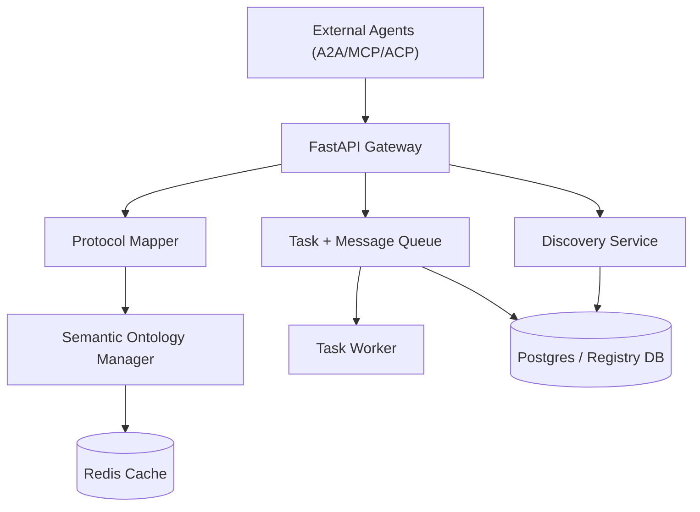

# Agent Translator Middleware

Neutral translation service that bridges A2A, MCP, and ACP protocols with semantic mapping, task orchestration, and agent discovery.

**Swagger UI**
Open `http://localhost:8000/docs` for the built-in FastAPI Swagger UI. The OpenAPI JSON is available at `http://localhost:8000/openapi.json`.

**Quick Start**
```bash
python -m venv venv
venv\Scripts\activate
pip install -r requirements.txt
uvicorn app.main:app --reload
```

**Docker (optional)**
```bash
docker compose up --build
```

**Configuration**
- `AUTH_ISSUER` (default: `https://auth.example.com/`)
- `AUTH_AUDIENCE` (default: `translator-middleware`)
- `AUTH_JWT_ALGORITHM` (default: `HS256`)
- `AUTH_JWT_SECRET` (required for HS* algorithms)
- `AUTH_JWT_PUBLIC_KEY` (required for RS*/ES* algorithms)
- `HTTPS_ONLY` (default: `false`)
- `TASK_POLL_INTERVAL_SECONDS` (default: `2`)
- `TASK_LEASE_SECONDS` (default: `60`)
- `TASK_MAX_ATTEMPTS` (default: `5`)
- `AGENT_MESSAGE_LEASE_SECONDS` (default: `60`)
- `AGENT_MESSAGE_MAX_ATTEMPTS` (default: `5`)
- `REDIS_ENABLED` (default: `true`)
- `REDIS_HOST` (default: `redis`)
- `REDIS_PORT` (default: `6379`)
- `REDIS_DB` (default: `0`)
- `REDIS_PASSWORD` (optional)
- `REDIS_URL` (optional, overrides host/port/db/password)
- `SEMANTIC_CACHE_TTL_SECONDS` (default: `600`)

**Security Notes**
- JWT authentication is required for `/api/v1/translate` with scope `translate:a2a`.
- Tokens must be issued by your auth service and validated via `AUTH_ISSUER` and `AUTH_AUDIENCE`.
- Rate limiting is enabled globally at 100 requests per minute per IP.
- In production, terminate TLS with Let's Encrypt and enable HTTPS redirect (`HTTPS_ONLY=true`).

**Architecture Diagram**


**Usage Examples (Integrating Agents)**
Register an agent in the registry:
```bash
curl -X POST http://localhost:8000/api/v1/register ^
  -H "Content-Type: application/json" ^
  -d "{\"agent_id\":\"agent-a\",\"endpoint_url\":\"http://agent-a:8080\",\"supported_protocols\":[\"a2a\"],\"semantic_tags\":[\"scheduling\"],\"is_active\":true}"
```

Translate a message between protocols:
```bash
curl -X POST http://localhost:8000/api/v1/translate ^
  -H "Authorization: Bearer <JWT>" ^
  -H "Content-Type: application/json" ^
  -d "{\"source_agent\":\"agent-a\",\"target_agent\":\"agent-b\",\"payload\":{\"intent\":\"schedule_meeting\",\"participants\":[\"alice@example.com\",\"bob@example.com\"],\"window\":{\"start\":\"2026-03-12T09:00:00Z\",\"end\":\"2026-03-12T11:00:00Z\"},\"timezone\":\"UTC\"}}"
```

Enqueue a task for asynchronous translation:
```bash
curl -X POST http://localhost:8000/api/v1/queue/enqueue ^
  -H "Content-Type: application/json" ^
  -d "{\"source_message\":{\"intent\":\"summarize\",\"content\":\"Summarize the attached report.\"},\"source_protocol\":\"a2a\",\"target_protocol\":\"mcp\",\"target_agent_id\":\"9b6c2c9b-7c8e-4f5b-9f3e-2a9cfa45c3b1\"}"
```

Agent polling and acknowledgement:
```bash
curl -X POST http://localhost:8000/api/v1/agents/9b6c2c9b-7c8e-4f5b-9f3e-2a9cfa45c3b1/messages/poll
curl -X POST http://localhost:8000/api/v1/agents/messages/<message_id>/ack
```

**Performance Notes**
- The database engine uses `asyncpg` via SQLAlchemy async engine for high-concurrency workloads.
- Semantic ontology lookups are cached in Redis to reduce repeated OWL searches.
- Profile the semantic mapper:
```bash
python -m app.semantic.profile_semantic_mapper --iterations 500
python -m app.semantic.profile_semantic_mapper --resolver --iterations 200
```
