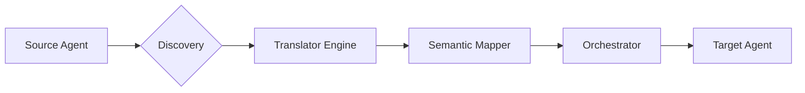

# Documentation Hub: Semantic Bridge

Welcome to the documentation for **Semantic Bridge**. This guide provides everything you need to build, test, and deploy universal agent-to-agent interoperability layers.

---

## 🧭 Navigation

### 🌟 Core Concepts
-   **[About Semantic Bridge](./about.md)**: The vision, mission, and philosophy behind the project.
-   **[System Architecture](./architecture.md)**: Diagrams and technical breakdown of the middleware layers.
-   **[EAT Security System](./usage.md#security-the-eat-system)**: How we handle identity and permissions.

### 🚀 Getting Started
-   **[Installation](./usage.md#installation)**: Docker and local setup.
-   **[Quickstart Guide](./usage.md#quickstart-example)**: Translate your first message in under 5 minutes.
-   **[API Reference](./usage.md#core-api-reference)**: TranslatorEngine, SemanticMapper, and more.

### 🍱 Strategic Features
-   **[MiroFish Swarm Bridge](./features/mirofish.md)**: Real-time predict + execute loops.
-   **[Trading Semantic Templates](./features/trading.md)**: Unified schemas for DeFi, exchanges, and payments.

### 🛠️ Operations
-   **[Testing & Performance](./testing.md)**: Unit tests, E2E flows, and JMeter load testing.
-   **[Deployment Guide](./deployment.md)**: Render, Cloud Run, and Kubernetes.
-   **[Monitoring](./usage.md#monitoring--observability)**: Metrics, Grafana, and TUI.

---

## 🏗️ The Request Handoff Cycle

All messages flowing through Semantic Bridge go through a high-fidelity translation pipeline to ensure operational reliability:

---

**Version 0.1.0** | *Universal Onboarding Layer*
