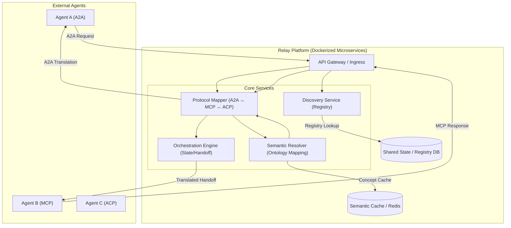

# System Architecture

The **Semantic Bridge** acts as a neutral agent translator middleware, abstracting away protocol-specific complexities (A2A, MCP, ACP) and resolving semantic differences to enable seamless cross-vendor collaboration.

---

## 🏛️ High-Level Architecture

---

## 🛠️ Core Components

### A. Protocol Mapper
- **Responsibility**: Translates the structural "envelope" of messages.
- **Function**: Converts between A2A (JSON-RPC/DID-Comm), MCP (Multi-Agent patterns), and ACP (Agent Communication Protocol).
- **Mapping Logic**: Maintains dynamic transformation rules as protocols evolve.

### B. Semantic Resolver (The Bridge)
- **Responsibility**: Translates the **content** or **meaning** of the payload.
- **Function**: Uses a common ontology or LLM-driven mapping to ensure that "DeliveryDate" in Agent A's protocol means the same as "arrival_estimated" in Agent B's protocol.
- **Fall-through Strategy**:
    1.  **Validation**: JSON Schema ensures the incoming payload matches the contract.
    2.  **Flattening**: Recursive walk converts nested structures into dotted paths.
    3.  **Explicit Rules**: PyDatalog provides near-instant renaming for high-traffic fields.
    4.  **Ontology**: `owlready2` resolves concepts in `protocols.owl`.
    5.  **ML Inference**: TF-IDF + Logistic Regression fallback for unknown fields.

### C. Discovery Service
- **Responsibility**: Registry and dynamic lookup.
- **Function**: Allows agents to register their capabilities and supported protocols.
- **Dynamic Discovery**: Calculates compatibility using:
  $$(shared\_protocols + mappable\_protocols) / total\_protocols$$

### D. Orchestration Engine
- **Responsibility**: Management of the transaction lifecycle.
- **Function**: Handles multi-turn handoffs, retries, and asynchronous persistence for complex tasks.
- **Safety**: Integrates with [Autonomy-Guard](https://autonomy-guard.io) to verify agent permissions and identity (EAT - Engram Access Token).

---

## 🚀 Deployment & Scalability

The architecture is designed as a set of containerized microservices:
- **Horizontal Scaling**: Each service can scale independently based on throughput.
- **Async Processing**: Tasks are handled via a robust PostgreSQL queue with a dedicated `TaskWorker`.
- **Infrastructure**: Optimized for both lightweight local development (SQLite/Memory) and high-availability production (Neon/Redis).

---

## 🧭 Data Flow Example

1.  **Agent X (A2A)** sends a message to the **Ingress**.
2.  **Discovery Service** identifies that **Agent Y** supports **MCP**.
3.  **Protocol Mapper** transforms the A2A envelope into an internal representation.
4.  **Semantic Resolver** maps Agent X's request parameters to Agent Y's required schema.
5.  **Orchestration Engine** routes the message to Agent Y and tracks the session.
6.  **Agent Y (MCP)** receives a perfectly formatted request.

---

**Version 0.1.0** | *Documentation Hub*
